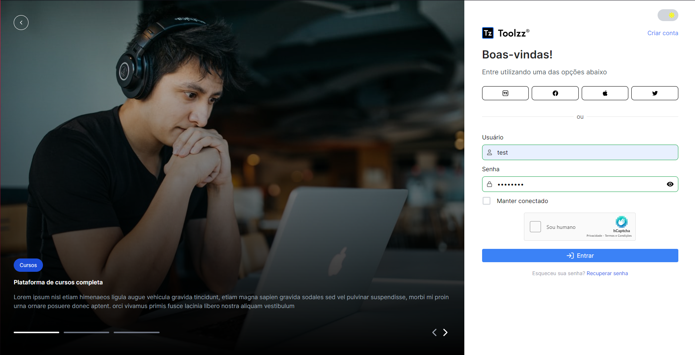
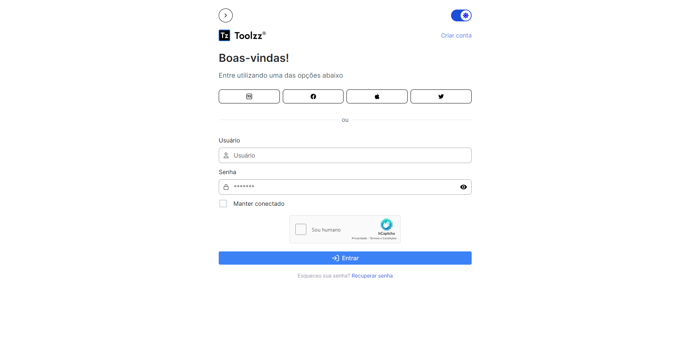
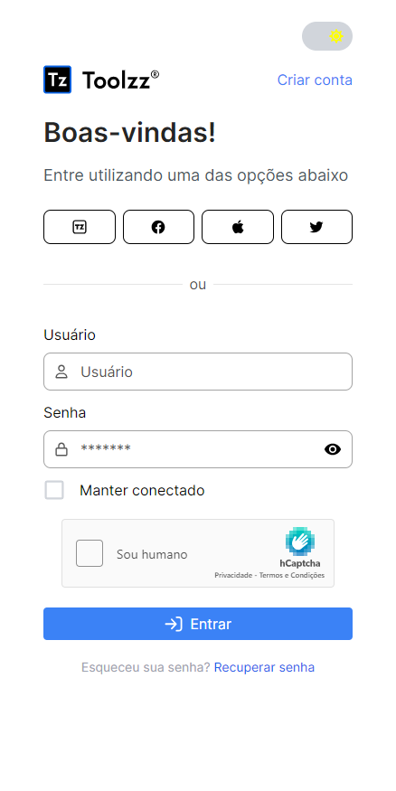
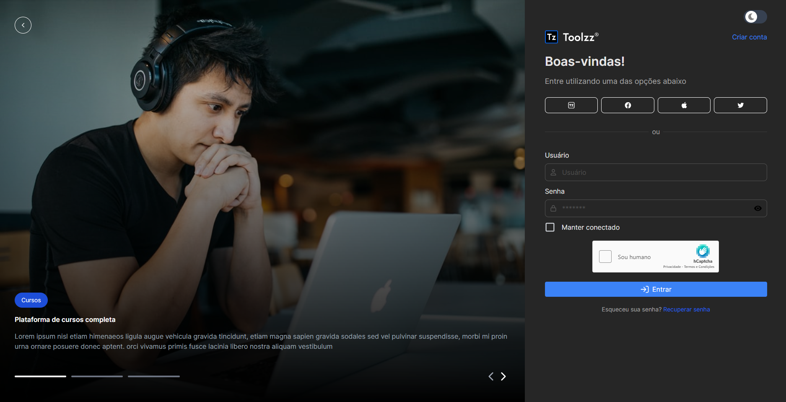
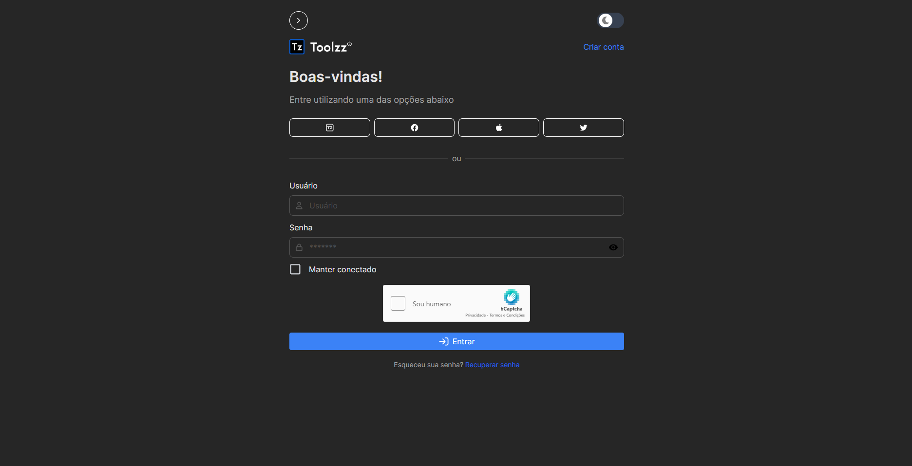

<p align="center">
  <h1 align="center">Login Page - React</h1>
</p>

## 📘 Sobre o Projeto

Este projeto é uma aplicação web de login responsivo, construída utilizando React JS e TypeScript. O layout foi concebido no Figma e a aplicação foi desenvolvida com base no design fornecido.

## 🖥️ Telas do Projeto

<table>
  <tr>
    <td align="center">Modo Claro - Web com Banner</td>
    <td align="center">Modo Claro - Web sem Banner</td>
    <td align="center">Modo Claro - Mobile</td>
  </tr>
  <tr>
    <td align="center"></td>
    <td align="center"></td>
    <td align="center"></td>
  </tr>
  <tr>
    <td align="center">Modo Escuro - Web com Banner</td>
    <td align="center">Modo Escuro - Web sem Banner</td>
    <td align="center">Modo Escuro - Mobile</td>
  </tr>
  <tr>
    <td align="center"></td>
    <td align="center"></td>
    <td align="center"></td>
  </tr>
</table>

## Experiência e Design do Usuário 🚀🎨

Nossa aplicação combina design intuitivo com funcionalidades essenciais para uma experiência de usuário superior. Adaptável a qualquer dispositivo, ela oferece responsividade, Dark Mode para conforto visual, notificações em tempo real e animações suaves para uma interação mais agradável.

O layout, projetado com foco na usabilidade e estética no Figma, está disponível para consulta. [Acessar Layout no Figma](https://www.figma.com/file/rMJhp5D79wnmq6h7r27cmv/Login---Teste?type=design&node-id=1%3A14027&mode=design&t=a5Gfvwa0lznfNflz-1), e inspire-se em nosso compromisso com uma navegação fluída e envolvente.

## Pré-requisitos e Tecnologias 🚧💻

Para executar este projeto, certifique-se de ter:

- Node.js (versão 14.0 ou superior)
- Git
- npm (ou yarn, conforme sua preferência)

Este projeto foi desenvolvido com:

- TypeScript: Para tipagem estática.
- React Js: Biblioteca principal para construção de interfaces.
- React Toastify: Para implementação de notificações elegantes.
- Framer Motion: Para animações fluidas e interativas.

## Acesso Online 🌐

Você pode acessar o projeto online através do seguinte link:

- [Acessar Projeto Online](https://login-react-phi.vercel.app)

## Instalação 🛠️

Siga estes passos para configurar o projeto localmente:

**Clonar o Repositório:**

   ```bash
   git clone https://github.com/aridsonf/login-react.git
   cd login-react
   ```

**Instalar Dependências e Iniciar o Projeto:**

   ```bash
   npm install
   npm run dev
   ```

**Configurar Variáveis de Ambiente:**
   Renomeie o arquivo `.env.example` para `.env` e ajuste as variáveis conforme necessário.

   ```bash
   REACT_APP_HCAPTCHA_SITEKEY=your-hcaptcha-site-key
  ```
**Dados de Demostração:**
    Utilize os seguites dados de demostração para mostrar a validação da página:
  - **Usuário:** test
  - **Senha:** 12345678

## 🤝 Como Contribuir

Sua contribuição é bem-vinda! Se você tiver sugestões para melhorar este projeto, sinta-se à vontade para fazer um fork do repositório, implementar as mudanças e criar um pull request. Seu feedback é muito valioso.
